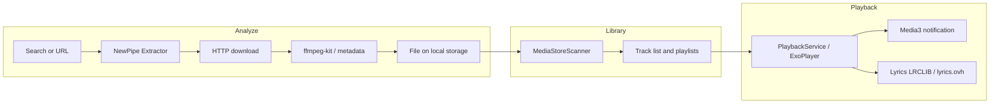

<p align="center">
  
</p>

<h1 align="center">BeatMyBeat</h1>

<p align="center">
  English · <strong><a href="README.es.md">Español</a></strong>
</p>

<p align="center">
  Open-source Android client to discover, download, and play music locally.<br/>
  <strong>No own server</strong> · <strong>No ads</strong> · <strong>GPL-3.0</strong>
</p>

<p align="center">
  
  
  
  
</p>

---

## What is BeatMyBeat?

**BeatMyBeat** is an Android application that combines in a single flow what is often split across several apps: **search music on YouTube and YouTube Music**, **download it to device storage**, **organize it in a library and playlists**, and **play it** with a full-featured player (queue, shuffle, repeat, lyrics, and system notification controls).

The project is **free and open source**. It does not monetize usage or host content on developer servers: network requests, stream extraction, and file storage all happen **entirely on the user’s phone**.

---

## How it works

The app is organized into three areas users navigate from the UI:

| Area | Screen | Purpose |
|------|--------|---------|
| **Discover & acquire** | Analyze | Search YouTube / YouTube Music or paste a URL (video, playlist, album). Track preview and background download. |
| **Library** | Player | Local audio scan (MediaStore), filters, user-created playlists, and track management. |
| **Listen** | Player + notification | Playback via Media3/ExoPlayer, persistent queue, notification controls, and synced lyrics when available. |

### Technical flow (on device)



1. **Metadata & stream** — NewPipe Extractor resolves the YouTube URL and selects a suitable audio stream.
2. **Download** — OkHttp downloads the file; `ffmpeg-kit` may transcode and embed title, artist, and artwork.
3. **Library** — Tracks become available to the local scanner and in-app playlists.
4. **Playback** — A foreground service maintains the queue, keeps the UI and system notification in sync, and optionally shows synced lyrics from public lyrics APIs.

There is no backend or middleware in this repository: older versions with a custom server were removed; the current architecture is a **self-contained Android client**.

---

## Main features

- Download from **YouTube** and **YouTube Music** (video, playlist, or album URL)
- **Player** with queue, shuffle, repeat, and “play next”
- User-created **local playlists**
- **Synced lyrics** (LRCLIB, lyrics.ovh) in the expanded player
- Material 3 **themes** with built-in profiles and color customization
- **Multiple UI languages** (es, en, de, pt, hr, and base resources)
- R8-optimized **release** APK; unit tests for queue and URL parsing

---

## Repository layout

```
BeatMyBeat/
├── README.md / README.es.md / README.en.md
└── app/                      # Gradle project (Android)
    ├── composeApp/
    │   └── src/androidMain/  # Kotlin + Compose + services
    ├── docs/                 # Documentation and assets
    ├── LICENSE               # GPL-3.0
    └── README.md             # Technical developer guide
```

Product code lives in [`app/composeApp/src/androidMain`](app/composeApp/src/androidMain/kotlin/com/imontalvodev/beatmybeat). Key modules:

- `ui/feature/` — screens (player, analyze/download, profile, theme, splash)
- `ui/network/` — unified HTTP (`AppHttpClient`), NewPipe, download, lyrics
- `service/`, `playback/`, `notifications/` — playback, downloads, notifications

Module details and conventions: [`app/README.md`](app/README.md).

---

## Requirements & build

| Requirement | Details |
|-------------|---------|
| IDE | Recent Android Studio or JDK 11+ with Android SDK |
| Min SDK | Defined in [`app/composeApp/build.gradle.kts`](app/composeApp/build.gradle.kts) |
| Release signing | Local keystore (not included in the repo) |

```bash
git clone https://github.com/imontalvodev/BeatMyBeat.git
cd BeatMyBeat/app

# Debug
./gradlew :composeApp:assembleDebug
./gradlew :composeApp:installDebug

# Release (R8 + resource shrinking)
./gradlew :composeApp:assembleRelease

# Unit tests
./gradlew :composeApp:testDebugUnitTest
```

Generated APKs (`*.apk`, `composeApp/release/`) and signing certificates are in `.gitignore`. Distribute them via **GitHub Releases** or another agreed channel, not via git commits.

---

## Documentation

| Document | Contents |
|----------|----------|
| [`app/README.md`](app/README.md) | Architecture, stack, and development |
| [`app/docs/optimizacion-limpieza.md`](app/docs/optimizacion-limpieza.md) | Cleanup/optimization plan (Phases A–D) — Spanish |
| [`app/docs/cambios.md`](app/docs/cambios.md) | Feature history — Spanish |
| [`app/docs/riesgos-legales.md`](app/docs/riesgos-legales.md) | Distribution: GitHub, F-Droid, sideload, Play Store — Spanish |
| [`app/docs/mejoras.md`](app/docs/mejoras.md) | UI ideas (partially historical) — Spanish |

---

## Tech stack

Jetpack Compose · Material 3 · Media3 / ExoPlayer · NewPipe Extractor · ffmpeg-kit · Coil · OkHttp

---

## Distribution

| Channel | Notes |
|---------|--------|
| **GitHub Releases** | Intended channel for signed APK; publish SHA-256 checksum when possible |
| **F-Droid** | Step-by-step guide: [`app/docs/fdroid-publicacion.md`](app/docs/fdroid-publicacion.md) · MR on [fdroiddata](https://gitlab.com/fdroid/fdroiddata) |
| **Manual install** | **Play Protect** may warn on APKs outside Play Store; this does not require a Google Play developer account for F-Droid |
| **Google Play** | Not planned (typical policies against YouTube downloaders) |

---

## License

This project is distributed under the **[GNU General Public License v3.0](app/LICENSE)**, consistent with the **NewPipe Extractor** dependency (GPL-3.0).

---

## Responsible use

BeatMyBeat distributes **software only**. It does not host or redistribute music or third-party protected content. Downloading from YouTube may **violate YouTube’s Terms of Service** and **copyright law** in your jurisdiction.

**Users are responsible** for lawful use and for complying with source platform terms. More detail per distribution channel: [`app/docs/riesgos-legales.md`](app/docs/riesgos-legales.md) (Spanish).

---

<p align="center">
  <sub>Maintained by <a href="https://github.com/imontalvodev">imontalvodev</a> · Technical docs in <a href="app/README.md">app/README.md</a></sub>
</p>
