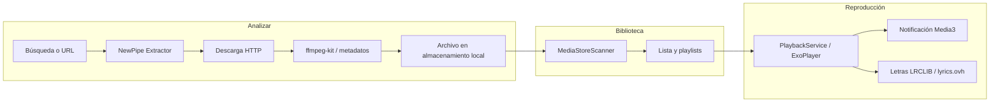

<p align="center">
  
</p>

<h1 align="center">BeatMyBeat</h1>

<p align="center">
  <strong><a href="README.en.md">English</a></strong> · Español
</p>

<p align="center">
  Cliente Android open source para descubrir, descargar y reproducir música en local.<br/>
  <strong>Sin servidor propio</strong> · <strong>Sin anuncios</strong> · <strong>GPL-3.0</strong>
</p>

<p align="center">
  
  
  
  
</p>

---

## ¿Qué es BeatMyBeat?

**BeatMyBeat** es una aplicación para Android que integra en un solo flujo lo que suele repartirse entre varias apps: **buscar música en YouTube y YouTube Music**, **descargarla al almacenamiento del dispositivo**, **organizarla en biblioteca y playlists** y **reproducirla** con un reproductor completo (cola, shuffle, repeat, letras y notificación de sistema).

El proyecto es **gratuito y open source**. No monetiza el uso ni aloja contenido en servidores del desarrollador: las peticiones de red, la extracción de streams y el guardado de archivos ocurren **íntegramente en el teléfono del usuario**.

---

## ¿Cómo funciona?

La app se organiza en tres bloques que el usuario recorre desde la interfaz:

| Bloque | Pantalla | Qué hace |
|--------|----------|----------|
| **Descubrir y obtener** | Analizar | Búsqueda en YouTube / YouTube Music o pegado de URL (vídeo, playlist, álbum). Vista previa de pistas y descarga en segundo plano. |
| **Biblioteca** | Reproductor | Escaneo de audio local (MediaStore), filtros, playlists creadas por el usuario y gestión de pistas. |
| **Escuchar** | Reproductor + notificación | Reproducción con Media3/ExoPlayer, cola persistente, controles en notificación y letras sincronizadas cuando están disponibles. |

### Flujo técnico (en el dispositivo)



1. **Metadatos y stream** — NewPipe Extractor resuelve la URL de YouTube y elige el stream de audio adecuado.
2. **Descarga** — OkHttp descarga el fichero; `ffmpeg-kit` puede transcodificar y embeber título, artista y carátula.
3. **Biblioteca** — Las pistas quedan disponibles para el escáner local y las playlists internas de la app.
4. **Reproducción** — Un servicio en primer plano mantiene la cola, sincroniza la UI y la notificación del sistema, y opcionalmente muestra letras sincronizadas desde APIs públicas de letras.

No existe backend ni middleware en este repositorio: versiones antiguas con servidor propio fueron retiradas; la arquitectura actual es **cliente Android autocontenido**.

---

## Funcionalidades principales

- Descarga desde **YouTube** y **YouTube Music** (vídeo, playlist o URL de álbum)
- **Reproductor** con cola, modo aleatorio, repetición y “reproducir a continuación”
- **Playlists** locales creadas por el usuario
- **Letras** sincronizadas (LRCLIB, lyrics.ovh) en el reproductor expandido
- **Temas** Material 3 con perfiles predefinidos y personalización de color
- **Varios idiomas** en la interfaz (es, en, de, pt, hr y recursos base)
- APK **release** optimizada con R8; tests unitarios de cola y parsing de URLs

---

## Arquitectura del repositorio

```
BeatMyBeat/
├── README.md / README.es.md / README.en.md
└── app/                      # Proyecto Gradle (Android)
    ├── composeApp/
    │   └── src/androidMain/  # Código Kotlin + Compose + servicios
    ├── docs/                 # Documentación y assets
    ├── LICENSE               # GPL-3.0
    └── README.md             # Guía técnica para desarrolladores
```

El código de producto está en [`app/composeApp/src/androidMain`](app/composeApp/src/androidMain/kotlin/com/imontalvodev/beatmybeat). Módulos relevantes:

- `ui/feature/` — pantallas (reproductor, analizar, perfil, tema, splash)
- `ui/network/` — HTTP unificado (`AppHttpClient`), NewPipe, descarga, letras
- `service/`, `playback/`, `notifications/` — reproducción, descargas y notificaciones

Detalle de módulos y convenciones: [`app/README.md`](app/README.md).

---

## Requisitos y compilación

| Requisito | Detalle |
|-----------|---------|
| IDE | Android Studio reciente o JDK 11+ con Android SDK |
| API mínima | Definida en [`app/composeApp/build.gradle.kts`](app/composeApp/build.gradle.kts) |
| Firma release | Keystore local (no incluido en el repositorio) |

```bash
git clone https://github.com/imontalvodev/BeatMyBeat.git
cd BeatMyBeat/app

# Depuración
./gradlew :composeApp:assembleDebug
./gradlew :composeApp:installDebug

# Release (R8 + reducción de recursos)
./gradlew :composeApp:assembleRelease

# Tests unitarios
./gradlew :composeApp:testDebugUnitTest
```

Los APK generados (`*.apk`, `composeApp/release/`) y los certificados de firma están en `.gitignore`. Distribúyelos mediante **GitHub Releases** u otro canal acordado, no mediante commits en git.

---

## Documentación

| Documento | Contenido |
|-----------|-----------|
| [`app/README.md`](app/README.md) | Arquitectura, stack y desarrollo |
| [`app/docs/optimizacion-limpieza.md`](app/docs/optimizacion-limpieza.md) | Plan y registro de optimización (Fases A–D) |
| [`app/docs/cambios.md`](app/docs/cambios.md) | Histórico de funcionalidades |
| [`app/docs/riesgos-legales.md`](app/docs/riesgos-legales.md) | Distribución: GitHub, F-Droid, APK manual, Play Store |
| [`app/docs/mejoras.md`](app/docs/mejoras.md) | Ideas de UI (parcialmente histórico) |

---

## Stack tecnológico

Jetpack Compose · Material 3 · Media3 / ExoPlayer · NewPipe Extractor · ffmpeg-kit · Coil · OkHttp

---

## Distribución

| Canal | Observaciones |
|-------|----------------|
| **GitHub Releases** | Canal previsto para APK firmado; conviene publicar checksum (SHA-256) |
| **F-Droid** | Requiere solicitud en [fdroiddata](https://gitlab.com/fdroid/fdroiddata); ver documentación legal |
| **Instalación manual** | Puede aparecer aviso de **Play Protect** en APKs fuera de Play Store; no requiere cuenta de desarrollador de Google para publicar en F-Droid |
| **Google Play** | No previsto (políticas habituales frente a descargadores de YouTube) |

---

## Licencia

Este proyecto se distribuye bajo la **[GNU General Public License v3.0](app/LICENSE)**, en línea con la dependencia **NewPipe Extractor** (GPL-3.0).

---

## Uso responsable

BeatMyBeat distribuye únicamente **software**. No aloja ni redistribuye música ni contenido protegido por terceros. La descarga desde YouTube puede **incumplir los términos de servicio** de la plataforma y la **normativa de propiedad intelectual** vigente en cada país.

**Quien instala y usa la aplicación es responsable** de cumplir la ley y las condiciones de las plataformas de origen. Más contexto por canal de publicación en [`app/docs/riesgos-legales.md`](app/docs/riesgos-legales.md).

---

<p align="center">
  <sub>Proyecto mantenido por <a href="https://github.com/imontalvodev">imontalvodev</a> · Documentación técnica en <a href="app/README.md">app/README.md</a></sub>
</p>
